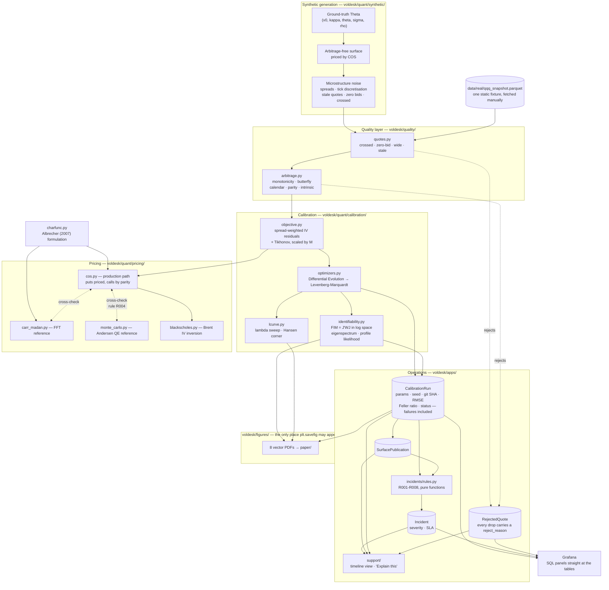

# Architecture

VolDesk has two halves that meet at exactly one place.

The **numerical core** (`voldesk/quant/`) is a pure library: NumPy and SciPy, no Django,
no database, no I/O beyond what a caller hands it. It can be imported, tested and
profiled with the web stack uninstalled. This is deliberate — `CLAUDE.md` invariant 1
requires the pricer to be validated before any Django code exists, and that is only
enforceable if the pricer cannot reach for a model.

The **operations layer** (`voldesk/apps/`, `voldesk/quality/`, `deploy/`) wraps that core
in persistence, a job queue, quality gates, an incident engine and dashboards. It calls
into the core; the core never calls back.

## Data and control flow



## Job execution

There is no broker. `CLAUDE.md` section 3 rules out Celery, Redis and RabbitMQ as
unjustified infrastructure for one user on one machine. Work is rows in a `Job` table,
claimed with row-level locks.

```mermaid
sequenceDiagram
    participant T as systemd timer<br/>voldesk-nightly
    participant E as enqueue_nightly
    participant DB as PostgreSQL
    participant W as voldesk-worker
    participant Q as quant core

    T->>E: fires on schedule
    E->>DB: INSERT Job (kind, payload, status=pending)
    loop poll
        W->>DB: SELECT ... FOR UPDATE SKIP LOCKED LIMIT 1
        DB-->>W: one job, locked to this worker
        W->>DB: status=running, locked_at=now()
        W->>Q: calibrate(slice, config, seed)
        alt success
            Q-->>W: fitted params + diagnostics
            W->>DB: CalibrationRun row + status=done
        else failure
            Q-->>W: exception
            W->>DB: CalibrationRun row (status=failed) + attempts+1
            Note over W,DB: exponential backoff;<br/>dead-letter after N attempts.<br/>A failed run is still persisted —<br/>invariant 2 has no exceptions.
        end
        W->>DB: run incident rules R001-R008
    end
```

`SKIP LOCKED` is what makes a second worker safe to start without coordination: it takes
the next unlocked row rather than blocking on the one already claimed. A worker killed
mid-job leaves its transaction uncommitted, so the lock dies with the connection and the
row returns to the pool — which is why Phase 4's acceptance criterion is tested by
actually killing the process.

## Layering rule

`voldesk/quant/` may import: numpy, scipy, and itself.
`voldesk/quality/` may import: numpy, polars, and `voldesk.quant`.
`voldesk/apps/` may import: anything, including both of the above.

Nothing in `voldesk/quant/` imports Django. A test enforces this
(`tests/test_layering.py`) — the alternative is that it decays quietly the first time
someone wants a setting.
